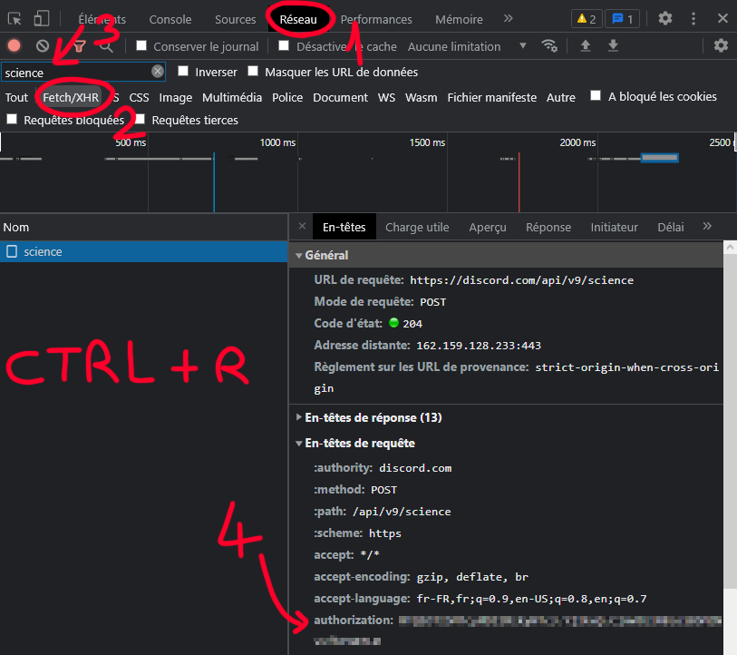

# Croissanted
A Python script exploiting Discord's authorization token.

# DISCLAIMER #
**Third party clients are not recommended and are against Discord's TOS. Use at your own risk (the program uses the Discord API to send messages and receive basic data, so you may not be banned, but be careful).**

# How to use #
You will need your authorization token to use the application.
You can get it in the "Network" tab of the development tools of your favourite web browser.
Simply filter by "Fetch/XHR" and look for "science" or other Discord related API endpoint.

  

Once you have your token, just run the program, it doesn't need any additional modules other than those installed by default in Python.
